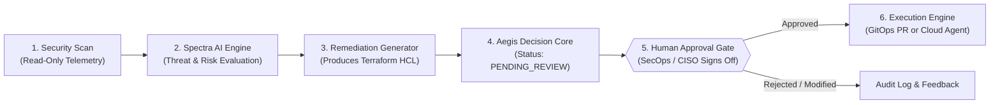

# Digital CISO Platform: Architecture Guide & Enterprise Demo Master Guide

---

# PART I: ARCHITECTURE GUIDE
## AI Decision, Human-In-The-Loop (HITL), MCP Server, Terraform & Read-Only Execution

---

## 1. Human-in-the-Loop (HITL) Decision & Execution Workflow

To ensure safety, compliance, and zero accidental cloud downtime, the platform implements the **Spectra-to-Aegis Pipeline**:



### How It Works:
1. **Automated Discovery**: Spectra identifies misconfigurations (e.g., OCI NSG open rules, unencrypted disks, overprivileged IAM policies).
2. **Deterministic Remediation Generation**: Generates the exact Terraform HCL code without touching infrastructure.
3. **HITL Approval Gate (`remediation_approve_playbook`)**:
   * The action enters **Aegis Decision Core** with state `PENDING_REVIEW`.
   * Displays the **exact diff**, affected assets, and blast radius.
   * Execution is **hard-blocked** until a verified human clicks **"Authorize Execution"** or calls the approval endpoint.

---

## 2. Using the MCP (Model Context Protocol) Server

The platform includes a built-in **MCP JSON-RPC 2.0 Gateway** compliant with Anthropic's specification at:
* **Gateway Endpoint**: `POST http://localhost:8000/api/v1/mcp`
* **Discovery Endpoint**: `GET http://localhost:8000/api/v1/mcp`

### Available MCP Tools:
| Tool Name | Description |
| :--- | :--- |
| `ciso_get_findings` | Query live findings by severity, provider (`azure`, `oraclecloud`, `aws`), or check ID |
| `ciso_get_resources` | Multi-cloud inventory inspection |
| `ciso_analyze_finding` | Deep AI root-cause and threat analysis on a finding |
| `ciso_get_compliance_overview` | Read compliance scores (CIS, SOC 2, ISO 27001, PCI-DSS) |
| `remediation_generate_playbook` | Generates Terraform HCL or CLI scripts |
| `remediation_approve_playbook` | **Human-in-the-Loop approval gate** |
| `remediation_execute_playbook` | Apply the approved fix |
| `ciso_advisor_query` | Ask natural-language security questions grounded in live telemetry |

### How to Connect External AI (Claude Desktop, Cursor, Roo/Cline):
Add the following snippet to your client's MCP configuration (e.g., `claude_desktop_config.json` or `mcp_config.json`):

```json
{
  "mcpServers": {
    "digital-ciso": {
      "url": "http://localhost:8000/api/v1/mcp",
      "headers": {
        "Authorization": "Bearer <YOUR_JWT_ACCESS_TOKEN>"
      }
    }
  }
}
```

---

## 3. Execution with Terraform

When a finding requires remediation, the platform produces reproducible Terraform modules:

1. **Generation**:
   ```hcl
   # Example: Auto-generated OCI NSG Ingress Restriction
   resource "oci_core_network_security_group_security_rule" "restricted_ingress" {
     network_security_group_id = "ocid1.networksecuritygroup.oc1..."
     direction                 = "INGRESS"
     protocol                  = "6" # TCP
     source                    = "10.0.0.0/16" # Internal CIDR only
     source_type               = "CIDR_BLOCK"
     tcp_options {
       destination_port_range {
         min = 22
         max = 22
       }
     }
   }
   ```
2. **Dry Run (`terraform plan`)**: The agent generates a plan artifact for visual review.
3. **Execution Gate**: Only after human authorization does the system trigger the plan execution.

---

## 4. How Execution Works with READ-ONLY Cloud Permissions

In almost all enterprise production environments, security scanners are **strictly granted Read-Only access** (such as OCI `inspect all-resources` or Azure `Reader` role) and **never given direct cloud write access**.

Here is how remediation works under Read-Only credentials:

### Strategy A: Automated GitOps Pull Requests (Recommended Enterprise Model)
* Digital CISO connects to your Git repository (GitHub / GitLab / Azure DevOps).
* When a finding is approved in Aegis, Digital CISO **creates a Pull Request** with the Terraform `.tf` diff in your infrastructure repository.
* Your internal CI/CD pipeline (GitHub Actions, Atlantis, or Terraform Cloud) applies the change using the customer's own internal privileged deployment role.

### Strategy B: Exportable Fix Packs & CLI Runbooks
* The customer clicks **"Export Remediation Script"** or **"Download Terraform Module"** in the UI.
* The DevOps engineer reviews the HCL and executes it locally using their standard `terraform apply` workflow.

### Strategy C: Jira / ServiceNow Integration
* When a high/critical finding is approved, Digital CISO generates a ticket with the exact Terraform snippet attached, routed to the team responsible for that specific compartment or subscription.

### Strategy D: Terraform Cloud / Spacelift Webhook
* Digital CISO pushes the code to a staging branch in Terraform Cloud, creating a speculative run ready for the workspace owner to click "Confirm & Apply".

---

## 5. Enterprise AI Data Security & Privacy (6 Pillars)

### 1. Zero Model Training & No Data Retention
* Customer cloud telemetry, configuration metadata, and finding descriptions are **never used to train, retrain, or fine-tune public LLMs**.
* The LLM processes queries in memory only. Once the response or remediation plan is generated, the context is discarded.
* **Self-Hosted Dedicated LLM Option (vLLM)**: Dedicated private GPU cluster on Azure VM with zero external internet dependencies.

### 2. Pre-Inference Secret Sanitization & PII Stripping Pipeline
* Deterministic regex pre-LLM filter removes private keys, RSA certs, cloud access keys, passwords, bearer tokens, and connection strings.
* Prompt injection protection against instruction hijacks.
* Only metadata is evaluated (never customer payload data or files).

### 3. Strict Multi-Tenant Isolation & Row-Level Security (RLS)
* PostgreSQL Row-Level Security (`RLS`) enforces that every query is partitioned by `tenant_id`.
* Zero cross-tenant data leakage.
* TLS 1.3 in transit, AES-256 at rest.

### 4. Human-in-the-Loop (HITL) Guardrails
* AI is strictly an analysis and recommendation advisor.
* No destructive or state-changing action is performed without explicit cryptographic sign-off in Aegis Decision Core.

### 5. Read-Only Telemetry Model (Least Privilege)
* Scans run under read-only auditor roles.
* Execution happens via GitOps PR or exportable runbooks.

### 6. Immutable Audit Trail & Regulatory Compliance
* Complete decision history logged in `DecisionLog` (timestamp, user, action, diff).
* Pre-aligned with SOC 2 Type II, ISO 27001:2022, GDPR, and NIST AI RMF 1.0.

---
---

# PART II: ENTERPRISE DEMO MASTER GUIDE
## All Customer Questions & Winning Answers

---

## 🤖 Category 1: AI & LLM Governance

### Q1: *"Is our cloud telemetry or finding data used to train or fine-tune your AI models?"*
* **Why They Ask**: Fear of corporate IP or security architecture leaking into public models.
* **Winning Answer**: 
  > *"Zero model training. We have a strict zero-retention policy. Your data is processed ephemerally in-memory to generate threat analyses and remediation plans, and is immediately discarded. Furthermore, we offer self-hosted, private LLM deployments (via dedicated vLLM on your own private Azure VM / GPU cluster) with zero external internet dependencies."*

### Q2: *"How do you prevent AI hallucinations when recommending cloud fixes?"*
* **Why They Ask**: Fear of AI generating broken code or hallucinating non-existent security flaws.
* **Winning Answer**: 
  > *"Our AI does not guess. It uses Grounded Retrieval (RAG) tied strictly to deterministic cloud audit rules, CIS benchmark specifications, and official cloud provider SDK definitions. Furthermore, every generated Terraform or CLI script undergoes static schema validation before presenting to the human engineer."*

### Q3: *"Can the AI take autonomous actions or delete/modify our infrastructure without our permission?"*
* **Why They Ask**: Fear of an AI agent accidentally bringing down production environments.
* **Winning Answer**: 
  > *"Never. We enforce a strict Human-in-the-Loop (HITL) gate via Aegis Decision Core. The AI operates in advisory mode—it generates the fix, calculates blast radius, and prepares a Pull Request. Execution is cryptographically blocked until an authorized human engineer reviews the diff and approves it."*

### Q4: *"What is the MCP Server and how can our developers use it?"*
* **Why They Ask**: Technical architects want to know how it integrates into existing developer workflows (Cursor, Claude, IDEs).
* **Winning Answer**: 
  > *"We expose a native Model Context Protocol (MCP) JSON-RPC 2.0 gateway (`POST /api/v1/mcp`). Your SecOps and DevOps engineers can connect Claude Desktop, Cursor IDE, or internal agents directly to Digital CISO to query findings, check compliance posture, or request remediation code directly inside their IDE."*

---

## 📜 Category 2: Compliance & Audit Readiness

### Q1: *"Which compliance frameworks do you support out-of-the-box?"*
* **Why They Ask**: Verifying if the platform covers their specific regulatory requirements.
* **Winning Answer**: 
  > *"We support 25+ global and regional frameworks across cloud, industry, government, and privacy, including Saudi NCA (ECC-1:2018 & CSCC-1:2019), CIS Benchmarks (Azure v2.0/v3.0, OCI v2.0, AWS v3.0, GCP), SOC 2 Type II, ISO/IEC 27001:2022, NIST CSF v2.0, NIST 800-53, PCI-DSS v4.0, HIPAA, GDPR, DORA, NIS2, and FedRAMP."*

### Q2: *"Can we generate an executive-ready audit report for external auditors (e.g. Big 4 / SOC 2 auditors)?"*
* **Why They Ask**: Manual audit preparation takes months of engineering time.
* **Winning Answer**: 
  > *"Yes. With one click on our Reports & Compliance engine, you can export timestamped compliance scorecards, control-by-control audit evidence, and passing/failing telemetry mapped directly to SOC 2 Trust Services Criteria or ISO 27001 Annex A controls."*

### Q3: *"How often is compliance score updated?"*
* **Winning Answer**: 
  > *"Continuously. As soon as automated or scheduled scans complete, your compliance matrix recalculates passing percentages, gap analyses, and control readiness in real-time."*

---

## 🔍 Category 3: Security Findings & Asset Discovery

### Q1: *"How does the platform handle false positives and deduplication?"*
* **Why They Ask**: Alert fatigue is the #1 pain point for Security Operations Centers (SOC).
* **Winning Answer**: 
  > *"Every finding is uniquely fingerprinted by resource UID, check ID, region, and compartment. Findings are deduplicated and tracked continuously over their lifecycle (Open ➔ In Review ➔ Remediated ➔ Verified). Security teams can also mute acknowledged risks with expiration dates and mandatory justification audit notes."*

### Q2: *"What is an 'Attack Path' and how does Digital CISO build it?"*
* **Why They Ask**: Finding isolated CVEs is easy; correlating multi-hop cloud breaches is hard.
* **Winning Answer**: 
  > *"We correlate isolated findings (e.g., an open NSG ingress port + an over-privileged IAM service principal + an unencrypted database) into toxic attack graph pathways. This shows you exactly how an external adversary could pivot from an internet-facing asset to your crown-jewel data."*

### Q3: *"How fast do findings appear after scanning?"*
* **Winning Answer**: 
  > *"Telemetry ingestion is streaming and synchronous. Scans complete in 30–60 seconds across large multi-region tenancies, and findings, severity scores, and remediation scripts are immediately queryable in the console."*

---

## ☁️ Category 4: Multi-Cloud Frameworks & Onboarding

### Q1: *"What cloud providers do you support, and how difficult is onboarding?"*
* **Winning Answer**: 
  > *"We natively support Microsoft Azure, Oracle Cloud (OCI), Amazon Web Services (AWS), Google Cloud (GCP), and Kubernetes clusters. Onboarding is agentless and takes under 3 minutes using standard cloud credentials or service principals."*

### Q2: *"Can users select specific regions or multi-region tenancies (e.g. UK, Europe, India, US)?"*
* **Winning Answer**: 
  > *"Yes. We support all 40+ global commercial and government regions (such as `uk-london-1`, `eu-frankfurt-1`, `centralindia`, `us-ashburn-1`), as well as dedicated private region keys with zero hardcoded region locks."*

---

## 🔐 Category 5: Data Security, Isolation & Permissions

### Q1: *"Do you require write permissions to our cloud accounts?"*
* **Why They Ask**: Enterprise security policies forbid giving 3rd-party SaaS write access to production.
* **Winning Answer**: 
  > *"No. We strictly adhere to the Principle of Least Privilege and require ONLY Read-Only auditor permissions (e.g., Azure Reader, OCI inspect all-resources, AWS SecurityAudit). To remediate, we generate Pull Requests to your Git repository (GitOps), so your own trusted CI/CD executes the change."*

### Q2: *"How do you isolate data between different corporate tenants?"*
* **Winning Answer**: 
  > *"We implement PostgreSQL Row-Level Security (RLS). Every query is cryptographically partitioned by `tenant_id` at the database kernel level. It is architecturally impossible for one tenant's queries or AI prompts to access another tenant's findings."*

### Q3: *"What happens to sensitive secrets or PII embedded in resource tags or configuration?"*
* **Winning Answer**: 
  > *"Our deterministic pre-inference Secret Sanitizer (`ai/sanitizer.py`) intercepts all data before it reaches the AI. It regex-matches and redacts RSA private keys, AWS/Azure access tokens, bearer headers, passwords, and database connection strings, replacing them with `[REDACTED]` markers."*

---

### 💡 Live Demo Execution Checklist:
1. **AI Advisor (`/ai/advisor`)**: Ask a live question (e.g., *"What are our OCI compliance gaps?"*), and highlight the grounded telemetry references.
2. **Aegis Decisions (`/ai/decisions`)**: Show the **Human-in-the-Loop gate**, the Terraform diff preview, and the authorization flow.
3. **Compliance Matrix (`/compliance`)**: Showcase the 20+ framework suite and one-click audit drill-down.
4. **Findings & Attack Paths (`/findings`, `/attack-paths`)**: Show real asset names, multi-cloud filters, and toxic attack chains.
